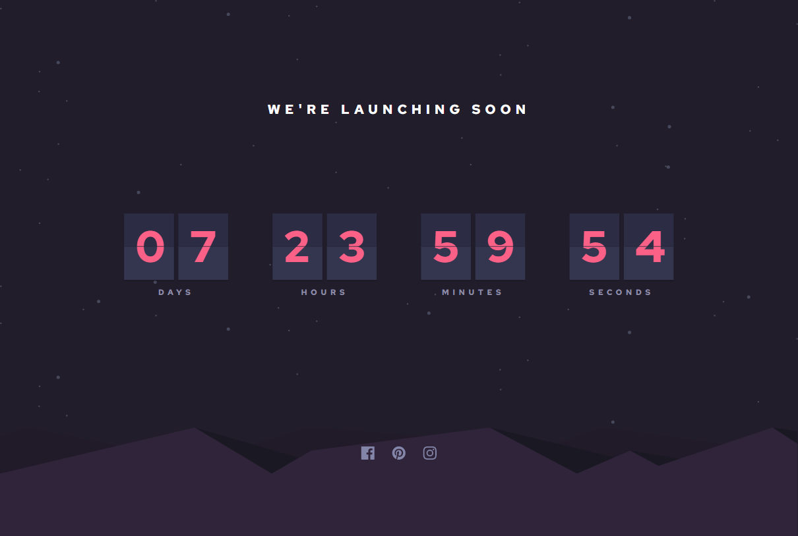
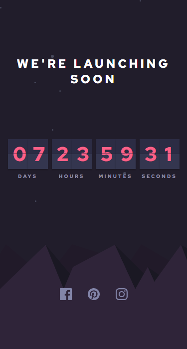

# Frontend Mentor - Launch countdown timer solution

## Table of contents

- [Overview](#overview)
  - [The challenge](#the-challenge)
  - [Screenshot](#screenshot)
  - [Links](#links)
- [My process](#my-process)
  - [Built with](#built-with)
  - [What I learned](#what-i-learned)
  - [Continued development](#continued-development)
  - [Useful resources](#useful-resources)
- [Acknowledgments](#acknowledgments)

## Overview

### The challenge

Users should be able to:

- See a live countdown timer that ticks down every second (start the count at 14 days)
- When a number changes, make the card flip from the middle

### Screenshot

## Desktop View

## Mobile View

### Links

- Solution URL: [CODE LINK](https://github.com/aashabul/countdown-timer-html-sass-js)
- Live Site URL: [LIVESITE LINK](https://loquacious-douhua-88f5d2.netlify.app/)

## My process

### Built with

- Semantic HTML5 markup
- SASS
- Flexbox
- JavaScript

### What I learned

Advanced level of DOM manipulation and Javascript animation.

### Continued development

Making the UI more responsive, a dark theme and light theme toogle button and some animations.

### Useful resources

- [Example resource 1](https://www.youtube.com/watch?v=p_6IuhmBsfc&t=2039s) - Helped me to understand how the animation works.
- [Example resource 2](https://stackoverflow.com/questions/13903897/javascript-return-number-of-days-hours-minutes-seconds-between-two-dates) - Learnt how to format days, hours, minutes and seconds from JavaScript Date object.

## Acknowledgments

This is a solution to the [Launch countdown timer challenge on Frontend Mentor](https://www.frontendmentor.io/challenges/launch-countdown-timer-N0XkGfyz-).
